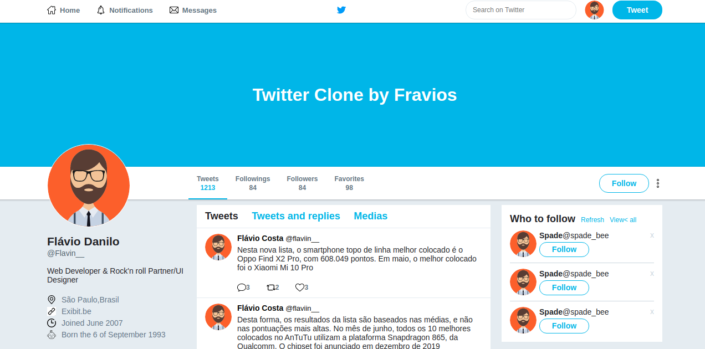

<h1 align="center">
  <br /><br />
</h1>
<h3 align="center">
 Twitter Clone with FlexBox
</h3>

<p align="center">
  

  <a href="https://www.linkedin.com/in/flávio-silva-da-costa-35535710b">
    
  </a>
  
  
  
  <a href="https://github.com/flavio022/twitter-clone-flex-box/commits/master">
    
  </a>
  
  <a href="https://github.com/flavio022/twitter-clone-flex-box/issues">
    
  </a>
  
  
</p>

<p align="center">
  <a href="#recycle-about-the-project">About the project</a>&nbsp;&nbsp;&nbsp;|&nbsp;&nbsp;&nbsp;
  <a href="#-technologies">Technologies</a>&nbsp;&nbsp;&nbsp;|&nbsp;&nbsp;&nbsp;
  <a href="#-getting-started">Getting started</a>&nbsp;&nbsp;&nbsp;|&nbsp;&nbsp;&nbsp;
  <a href="#-how-to-contribute">How to contribute</a>&nbsp;&nbsp;&nbsp;|&nbsp;&nbsp;&nbsp;
  <a href="#-license">License</a>
</p>


## :recycle: About the project

This project was developed on the FlexBox curse by [Rocketseat](https://rocketseat.com.br/) &nbsp;🚀💜

With the idea to improve my knowledge of flexBox css.

## 🚀 Technologies

Technologies that I used to develop

- [Htlm5](https://www.w3schools.com/tags/tag_doctype.asp)
- [CSS3](https://www.w3schools.com/css/)

**Clone the project and access the folder**

```bash
$ git clone https://github.com/flavio022/twitter-clone-flex-box
```

## 🤔 How to contribute

**Make a fork of this repository**

```bash
# Fork using GitHub official command line
# If you don't have the GitHub CLI, use the web site to do that.

$ gh repo fork flavio022/twitter-clone-flex-box
```

**Follow the steps below**

```bash
# Clone your fork
$ git clone your-fork-url && cd twitter-clone-flex-box

# Create a branch with your feature
$ git checkout -b my-feature

# Make the commit with your changes
$ git commit -m 'feat: My new feature'

# Send the code to your remote branch
$ git push origin my-feature
```

After your pull request is merged, you can delete your branch

## 📝 License

This project is licensed under the MIT License - see the [LICENSE](LICENSE) file for details.

---

Made with 💜&nbsp; by Flávio Costa 👋 &nbsp;[See my linkedin](https://www.linkedin.com/in/flávio-silva-da-costa-35535710b)
